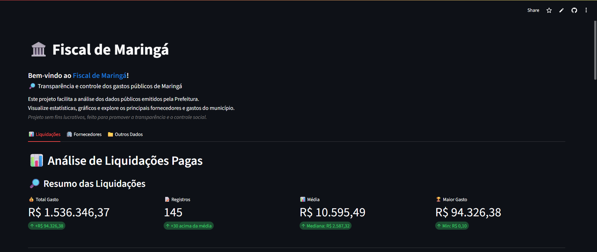

# 🏛️ Fiscal de Maringá



## 📋 Sobre o Projeto

O **Fiscal de Maringá** é uma ferramenta de análise de dados públicos desenvolvida para facilitar a visualização e compreensão dos gastos da Prefeitura de Maringá. O projeto promove a transparência e o controle social através de dashboards interativos e visualizações dinâmicas.

## 🎯 Objetivos

- 📊 **Transparência**: Tornar os dados públicos mais acessíveis e compreensíveis
- 🔍 **Análise**: Facilitar a identificação de padrões nos gastos públicos
- 📈 **Visualização**: Apresentar informações de forma clara através de gráficos interativos
- 🏢 **Controle Social**: Permitir que cidadãos acompanhem os gastos do município

## ✨ Funcionalidades

### 📊 Dashboard de Liquidações
- Estatísticas gerais dos gastos
- Top 10 fornecedores por valor
- Distribuição de gastos por fornecedor
- Evolução temporal dos gastos
- Visualização completa dos dados

### 🏢 Análise de Fornecedores
- Histórico detalhado por fornecedor
- Ranking de fornecedores
- Análise de performance

### 📁 Outros Dados
- Extensível para novos tipos de análises
- Suporte a diferentes fontes de dados

## 🚀 Tecnologias Utilizadas

- **Frontend**: [Streamlit](https://streamlit.io/) - Framework para criação de aplicações web em Python
- **Visualização**: [Plotly](https://plotly.com/) - Gráficos interativos
- **Processamento**: [Pandas](https://pandas.pydata.org/) - Análise e manipulação de dados
- **Deploy**: Streamlit Cloud

## 🛠️ Como Executar Localmente

1. **Clone o repositório**
   ```bash
   git clone https://github.com/joaopaulotr/FiscalDeMaringa.git
   cd FiscalDeMaringa
   ```

2. **Instale as dependências**
   ```bash
   pip install -r backend/requirements.txt
   ```

3. **Execute a aplicação**
   ```bash
   cd backend
   streamlit run app_streamlit.py
   ```

4. **Acesse no navegador**
   ```
   http://localhost:8501
   ```

## 📁 Estrutura do Projeto

```
FiscalDeMaringa/
├── backend/
│   ├── app_streamlit.py      # Aplicação principal
│   ├── coletor.py           # Processamento de dados
│   ├── requirements.txt     # Dependências
│   └── *.csv               # Arquivos de dados
├── image.png               # Logo do projeto
├── README.md              # Este arquivo
└── LICENSE               # Licença
```

## 📊 Dados

O projeto utiliza dados públicos de liquidações pagas pela Prefeitura de Maringá, processando informações sobre:

- 💰 Valores pagos
- 🏢 Fornecedores
- 📅 Datas das liquidações
- 📝 Números de empenho
- 📋 Tipos de licitação

## 🤝 Contribuindo

Este é um projeto open-source! Contribuições são bem-vindas:

1. Faça um fork do projeto
2. Crie uma branch para sua feature (`git checkout -b feature/NovaFeature`)
3. Commit suas mudanças (`git commit -m 'Adiciona nova feature'`)
4. Push para a branch (`git push origin feature/NovaFeature`)
5. Abra um Pull Request

## 📄 Licença

Este projeto está sob a licença MIT. Veja o arquivo [LICENSE](LICENSE) para mais detalhes.

## 👨‍💻 Desenvolvedor

**João Paulo**
- GitHub: [@joaopaulotr](https://github.com/joaopaulotr)

---

<div align="center">
  <b>🏛️ Fiscal de Maringá &copy; 2025</b><br>
  <i>Projeto sem fins lucrativos para promover transparência e controle social</i>
</div>
